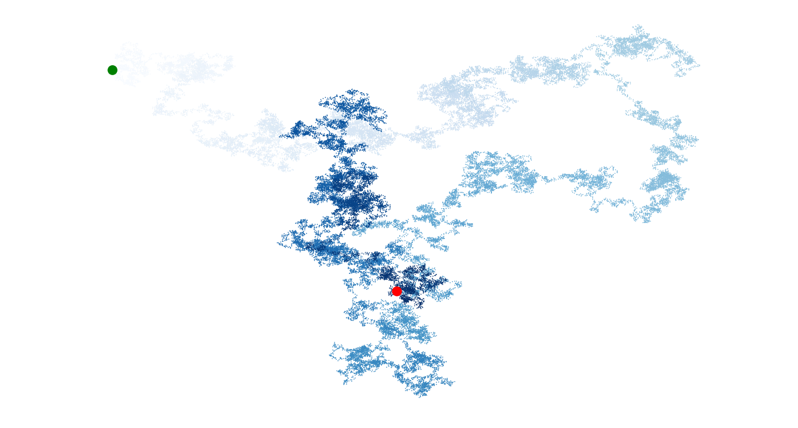
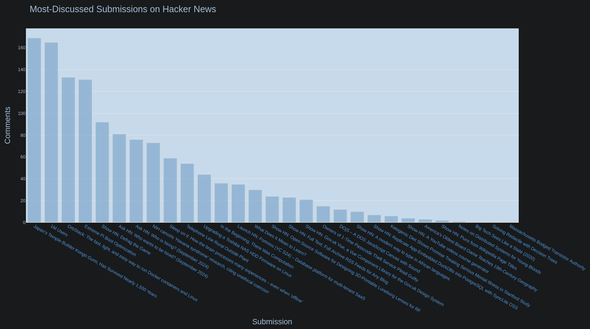

# data_visualization

This is a collection of visualizations using Matplotlib and Plotly based on a 
variety of datasets, ranging from numbers-to-squares, successive dice rolls
and random walks to local high-low temperatures (Kharkiv, UA, 2023), earthquakes 
that took place worldwide (Aug-Sep/2024), most popular GitHub Python repositories 
and most discussed news articles on a chosen website (Hacker News).

Squares, dice rolls and random walk data were generated automatically.

Weather data report was downloaded manually from https://www.noaa.gov/

Earthquake data report was downloaded manually from https://earthquake.usgs.gov/

Data related to GitHub repositories and Hacker News articles was extracted
automatically using API.

<div align=center margin=auto> 
  
  
</div>

<div align=center margin=auto> 
  
</div>

<div align=center margin=auto> 
  
</div>

<div align=center margin=auto> 
  
</div>

<div align=center margin=auto> 
  
</div>

<div align=center margin=auto> 
  
</div>

<div align=center margin=auto> 
  
</div>


## Table of Contents
1. [Prerequisites](README.md#prerequisites)
2. [Installation on Linux](README.md#installation-on-linux)
    * [Standard dependencies](README.md#standard-dependencies)
    * [Repository import](README.md#repository-import)
    * [Project-specific dependencies](README.md#project-specific-dependencies)
3. [How to run](README.md#how-to-run)
    * [General instructions](README.md#general-instructions)
    * [Visualization options](README.md#visualization-options)


## Prerequisites
To run the program, you need the following components installed:

**Standard dependencies**
- Python 3.x
- Pip
- Git
- Pipenv (optional, if you want to keep dependencies and run the program in a 
virtual environment) 

**Project-specific dependencies**
- Matplotlib (to create visualizations in a dedicated window)
- PyQt6 (to ensure working output display of Matplotlib visualizations)
- Plotly (to create browser-based visualizations)
- Requests (to extract data using API)


## Installation on Linux

### Standard dependencies
Please refer to the corresponding official sources for:
- Python: https://www.python.org/downloads/
- Pip: https://pip.pypa.io/en/stable/installation/
- Git: https://git-scm.com/book/en/v2/Getting-Started-Installing-Git
- Pipenv: https://pipenv.pypa.io/en/latest/

### Repository import
- Go to the directory you'd like to have this repository in and open the 
directory in terminal
- Enter the following command:

```
>>> git clone https://github.com/okharkevych/data_visualization.git
```

### Project-specific dependencies
Enter the following command:

```
>>> python3 -m pip install --user matplotlib pyqt6 plotly requests
```
OR (if using pipenv virtual environment)
- Open alien_invasion directory downloaded earlier in terminal
- Enter the following commands:
```
>>> pipenv shell
>>> pipenv install matplotlib pyqt6 plotly requests
```

## How to run

### General instructions
- Go to data_visualization directory downloaded earlier
- If the visualization module you want to run is in this directory, open this
directory in terminal and skip to entering command(s). Otherwise, go deeper to
the directory containing the module in question, open the directory in terminal 
and enter the command below:

```
>>> python3 -m visualization_module_you_want_to_run
```
OR (if using pipenv virtual environment; while in data_visualization directory)
```
>>> pipenv shell
>>> cd path_to_module_dir
>>> python -m visualization_module_you_want_to_run
```

### Visualization options
**Modules that can be run from data_visualization**
```
mpl_squares
scatter_squares
```

**Modules that can be run from data_visualization/dice**
```
die_visual
dice_visual
```

**Modules that can be run from data_visualization/random_walk**
```
rw_visual
```

**Modules that can be run from data_visualization/weather_from_csv**
```
citka_highs
citka_highs_lows
death_valley_highs_lows
kharkiv_highs_lows
```

**Modules that can be run from data_visualization/earthquakes_from_json**
```
eq_world_map
eq_world_map_aug_sep_2024
```

**Modules that can be run from data_visualization/starred_projects_from_github**
```
python_repos_visual
```

**Modules that can be run from data_visualization/hacker_news_api**
```
hn_submissions_visual
```